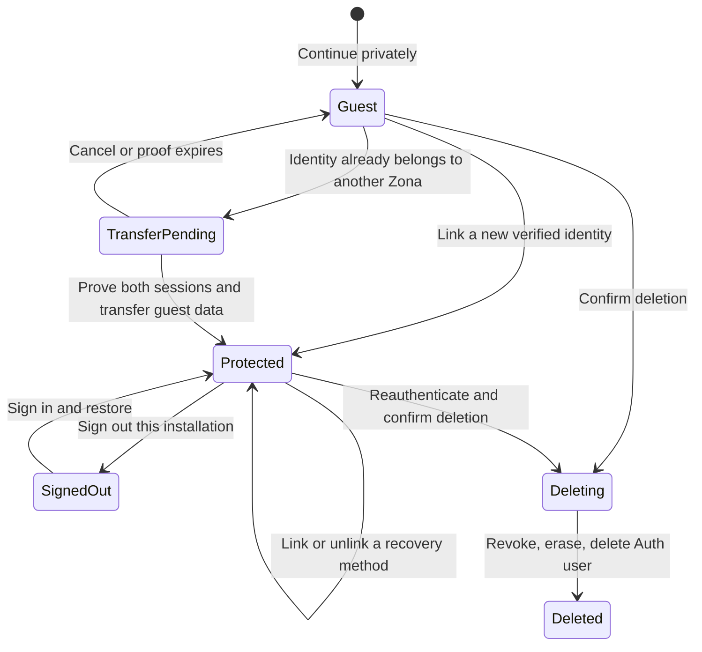
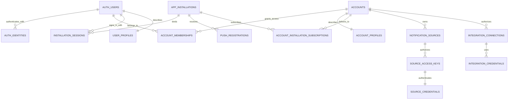

# Zona account management design

Status: shipped in v0.0.8 (migrations, Edge Functions, and client account
flows). This document is the contract those features implement; the baseline
section below records the pre-v0.0.8 state it replaced.

## Product outcome

Zona should be effortless to try and safe to keep. A new user may continue as
a private guest, then protect that same Zona with email, Apple, Google, or
GitHub without losing sources, settings, or inbox history. After protection,
the user can sign in on a replacement phone and recover server-held data.

The word **account** means the container that owns Zona data and future paid
access. A **user** is a human Supabase Auth record that can authenticate through
one or more **identities**. An **installation** is one app install. A **source**
is a machine/application credential that can only send alerts. An
**integration** is a future connection to an external service. These are
different security principals and must never share credentials.

## v0.0.8 scope

### Required

- Keep the current one-tap guest start.
- Add passwordless email, Sign in with Apple, Google, and GitHub.
- Upgrade a guest by linking a new identity to the current Auth user so its
  `auth.users.id` and all existing ownership remain unchanged.
- Restore a protected account on another phone.
- Show linked sign-in methods and a verified recovery email when an email
  identity is linked.
- Let users link another method and unlink a method when another recovery
  method remains.
- List app installations and revoke another installation.
- Preserve source IDs, existing key validity/metadata, preferences, recent
  inbox history, and entitlements after account recovery.
- Make provider conflict and account-transfer behavior explicit; never merge
  accounts because two provider profiles happen to show the same email.
- Extend account deletion to revoke sessions, installations, source keys, and
  future integration credentials before deleting owned data and the Auth user.

### Deferred but prepared

- Passkeys and MFA.
- Microsoft and custom OIDC/SAML providers.
- Team accounts, invitations, and role management.
- Public OAuth consent for third-party Zona clients.
- Self-service merging of two protected accounts. The schema and audit model
  allow it, but v0.0.8 only transfers an unprotected guest into a protected
  account after proving both sessions.

## Pre-v0.0.8 baseline and migration hazards

- The sign-in screen called only `signInAnonymously()` (it now also ships
  passwordless email, Apple, Google, and GitHub).
- The Supabase client used PKCE and `detectSessionInUrl=false`, but the app had
  no `/auth/callback` route or code-exchange handler, so the `zona` URL scheme
  could not complete email/OAuth recovery by itself (an `/auth/callback` route
  with code exchange now ships).
- Owner caches and Realtime topics are keyed by the Auth user UUID. A same-UUID
  guest upgrade is safe; an unplanned provider sign-in to another UUID clears
  local state and leaves the guest's server data behind.
- The persistent installation ID and Expo token can conflict when switching
  users unless the server atomically transfers/unregisters that installation.
- Local sign-out did not provide a session list or remote revocation (the
  account screen now lists installations and revokes sessions remotely).
- Current deletion spans Storage, Postgres, and Auth in separate steps. The new
  job/tombstone model is required before presenting it as resumable.
- SecureStore is device-only by design. Recovery must come from authenticating
  again, never from copying refresh tokens through phone backup.

## Provider policy

| Method | New protected account | Protect current guest | Link later | Initial recovery use |
| --- | --- | --- | --- | --- |
| Email OTP/magic link | Explicit sign-up or sign-in intent | `updateUser({ email })`, then verify | Yes | Yes |
| Email + password | `signUp({ email, password })`, then verify code | `updateUser({ email, password })`, then verify code | Yes | Yes |
| Apple | Native ID token preferred on iOS | `linkIdentity` or native ID-token linking | Yes | Yes |
| Google | OAuth/PKCE or native ID token | `linkIdentity` | Yes | Yes |
| GitHub | OAuth/PKCE | `linkIdentity` | Yes | Yes |

Apple is a first-class method on iOS because Zona also offers other
social login methods. Provider profile names and avatars are convenience data,
not authorization claims. Zona stores only the minimum profile data needed for
the account UI.

Manual identity linking must be enabled in Supabase. Provider secrets stay in
Supabase/Apple/Google/GitHub configuration and never enter the Expo bundle.
The app contains only the Supabase publishable key and public provider client
identifiers where required.

Supabase may automatically unify verified identities with the same email inside
one Auth user. Zona still never uses email equality to merge two application
accounts or move owned data; any resulting account conflict follows the proof
and transfer flow below.

Email has three distinct intents. `sign_in` calls `signInWithOtp` with
`shouldCreateUser=false`; `sign_up` uses `shouldCreateUser=true` only after the
user explicitly chooses to create an account; `protect_guest` updates and
verifies the current anonymous user. Outward responses remain non-enumerating,
so a mistyped address never silently creates an empty account from the sign-in
form.

The canonical recovery email is a verified Supabase `email` identity. An email
inside Google/GitHub/Apple profile metadata is only a display hint and is not a
Zona email recovery method. Adding or changing the recovery email completes
Supabase verification before the old method is removed.

## Account lifecycle

### Guest creation

`signInAnonymously()` creates a normal Supabase Auth user with
`is_anonymous=true`. The app creates or resolves that user's personal account.
Guest sessions receive the same owner-scoped RLS as protected users, but the UI
must explain that reinstalling or signing out makes the account unrecoverable.

Anonymous sign-up stays rate-limited and should use CAPTCHA/attestation when
abuse warrants it. A guest cannot enable paid recovery-dependent capabilities
until at least one identity is verified.

### Protecting a guest

The default path links a *new* identity while the guest is still signed in.
This is an in-place upgrade:

1. Record the current Auth user ID and personal account ID.
2. Start email verification or provider identity linking.
3. Complete the deep-link/OAuth callback and validate its state/PKCE result.
4. Refresh the user from Supabase, not only the local JWT.
5. Verify the Auth user ID did not change and `is_anonymous` is now false.
6. Verify at least one identity is present.
7. Mark the account protected and show a recovery-success receipt.

No ownership rows move in this path. Existing source credentials continue to
work because the Auth user ID remains stable.

### Signing in and restoring

A signed-out user selects a provider or requests an email OTP/magic link. On
success, Zona resolves the personal account, registers the current
installation, refreshes the push token, and synchronizes server-held data.

Restored data includes source/key metadata, source settings, account
preferences, active entitlements, and retained inbox items/attachments. The
one-time plaintext source token is intentionally **not** recoverable from Zona;
the sender already holding it continues working. A lost sender token must be
replaced with a new key.

Local caches are never copied between accounts. They remain keyed by account
and are cleared when the active account changes. Restore progress should say
what is syncing and keep cached content visible only for the matching owner.

### Provider conflict and guest transfer

If a user tries to protect a guest with an identity already attached to another
Zona user, linking must stop. Zona presents three choices:

- keep using the current guest;
- sign in to the existing Zona and leave the guest untouched; or
- transfer this guest into the existing protected account.

Transfer is a privileged, idempotent server workflow:

1. While authenticated as the guest, create a short-lived transfer challenge.
   Store only a hash of its random verifier and bind it to the guest user,
   installation, expiry, and one-time state.
2. Authenticate the destination through a second Supabase client whose PKCE
   verifier and session use a job-scoped temporary SecureStore namespace,
   isolated from the main guest client. Normal AuthProvider, cache, and push
   side effects remain suppressed. The destination session completes the server
   challenge; its refresh token is not installed as the main session before
   transfer commit.
3. Show a transfer preview: source count, retained notifications, preferences,
   installations, and any limit conflict. Require a final confirmation.
4. Mark the guest `transfer_locked` to stop guest mutation and ingestion. Copy
   attachment objects resumably into a service-only staging prefix without
   holding a database transaction open. The transfer job records every staged
   object; neither account can read the staging prefix.
5. In one short database transaction, lock both accounts, defer the reviewed
   composite owner constraints, re-check proofs/limits, and reassign every
   account-owned row. Destination preferences and entitlements win. Guest
   sources and history are
   appended. Duplicate source names are allowed because UUIDs remain distinct.
   The current installation moves to the destination. Push tokens are
   de-duplicated. Every active source key transfers with its source and remains
   valid; v0.0.8 does not let users exclude individual keys.
6. Publish staged objects to final destination paths, activate destination
   ownership, remove the old/staged objects, revoke all guest sessions, delete
   remaining guest-only preferences/data, then delete the guest Auth user. Keep
   a content-free audit result. If any step before database commit fails,
   cleanup every staged/final copy, unlock the still-usable guest, and leave its
   main session/data authoritative. Cancel/expiry clears temporary auth/storage
   state and also restores the guest unchanged. A scheduled cleanup removes
   expired/orphaned staged objects.

After a committed job reaches its terminal state, the account coordinator moves
the isolated destination session into the main Supabase client, then clears the
temporary namespace and performs intentional guest cache/push cleanup. On
process death, startup resumes from the transfer job and temporary session. If
that session was lost after commit, signing in to the destination again recovers
the terminal job result; the guest account is never recreated or reopened.

After commit, the guest account becomes a private `transferred` tombstone with
`transferred_to_account_id`, while the non-cascading transfer job keeps snapshot
UUIDs and its idempotent result. Neither record contains content or secrets.
They are retained for the operational replay/support window, then purged. The
personal-account ensure function cannot reopen a transferred account, and a
retry returns the original terminal result.

Transfer cannot ship while the current non-deferrable composite owner foreign
keys make coordinated `user_id` reassignment impossible. A preparatory
migration adds/backfills `account_id`, changes the source/user composite
constraints to reviewed deferrable constraints, and updates in the same short
transaction at least `sources`, `api_keys`, `notifications`, ingest/rate rows,
and installation/push ownership. Storage paths are handled by the staged object
copy. Transfer stays feature-disabled until this populated-data test passes
without disabling constraints.

v0.0.8 must not automatically merge two protected accounts. That needs a
separate recovery/support flow with recent reauthentication of both accounts,
purchase reconciliation, and a new ADR.

### Link and unlink

- Linking requires a current session and recent reauthentication for a
  protected account.
- The callback intent (`sign_in`, `protect_guest`, or `link_method`) is stored
  in a short-lived, single-use transaction; the callback cannot choose it.
- Unlinking requires recent reauthentication and at least one other verified
  recovery method.
- The app blocks removing the last recovery method and explains which method
  will remain.
- Provider emails are displayed as hints only. Authorization uses Supabase
  identity IDs and the active user session.
- Reauthentication uses an email OTP or a fresh provider/native ID-token flow.
  It creates a server-owned grant valid for at most ten minutes, bound to
  account, user, JWT `session_id`, installation, exact action/identity, expiry,
  and single use. Provider/email proof runs through an isolated, non-persisted
  client and must return the same Auth user ID. A client timestamp or merely
  refreshed JWT is not proof. For unlinking, the user proves the method that
  will remain usable.
- Every link/unlink/email-change event is written to a redacted account audit
  log and, where supported, sends a security notification email.

### Sign-out and session revocation

The account screen separates:

- **Sign out this phone:** unregister push, revoke or locally remove this
  session, clear owner-scoped private state, and return to sign-in.
- **Remove a phone:** immediately revoke its Zona installation/session mapping
  and push subscription after recent reauthentication.
- **Sign out other phones:** use Supabase's supported `others` scope to revoke
  all other Auth refresh sessions while keeping the current session, and in the
  same coordinated workflow revoke every other installation-session mapping,
  account subscription, and push registration.
- **Sign out everywhere:** revoke all sessions, disable all app installations,
  clear this phone, and return to sign-in.

The installation list shows platform, user-assigned name, approximate last
activity, app version, and current-device marker. It never exposes push tokens,
IP addresses, or refresh tokens. Sign-out and deletion also dismiss delivered
notifications, stop Live Activity, and remove user-specific Android channels.

Supabase does not provide a supported admin operation that selects an arbitrary
other session using only its session ID. Selected-phone removal therefore
denies that bound `session_id` in Zona RLS/RPC/Edge authorization and disables
push immediately; global/`others` sign-out revokes Auth refresh sessions. Short
JWT lifetime bounds generic Auth-token lifetime, while every Zona data path
checks the session denylist for immediate application denial.

Supabase manual identity linking is itself a public Auth capability for any
valid user session. Supabase currently enforces login and a minimum of two
identities before unlinking, but Zona cannot place a server hook in front of a
direct `linkIdentity`, `unlinkIdentity`, or `updateUser` call. The ten-minute
proof, “prove the remaining method,” security notice, and audit are enforced by
the Zona app flow as defense in depth, not claimed as an unbypassable Auth
control. Server enforcement remains strict for Zona-owned transfer, session,
source, integration, billing, export, and deletion operations. A stronger
identity-mutation gate requires a future Auth proxy/provider capability.

For v0.0.12, email/password linking, email changes, and password changes use
the same app-level defense-in-depth policy as provider linking. The app
prompts for recent reauthentication where the existing identity-mutation flow
does, but it does not introduce a new server-side reauth gate ahead of
Supabase's direct Auth APIs. Reauth-gated credential mutation is a named
hardening follow-up.

### Account deletion

Protected users must recently reauthenticate before the existing two-step
confirmation. Deletion is fail-closed and ordered:

1. Mark the account `deleting` and block new sources, ingestion, transfers,
   purchases, and integrations.
2. Revoke source access keys and integration credentials immediately.
3. Disable push registrations and deny every other installation/session. Keep
   only the initiating session as a deletion-only capability until final Auth
   removal; it cannot access normal Zona data.
4. Remove attachments and all account-owned content/billing rows, except the
   blocked account tombstone and non-cascading deletion ledger.
5. Revoke the final session and delete linked provider identities by deleting
   the Supabase Auth user.
6. Verify the Auth user no longer exists, then mark a redacted, non-cascading
   deletion ledger complete. Retain the account row as a blocked tombstone for
   the operational retention window, then purge it separately.

Deletion returns a non-sensitive cleanup count. Failed jobs remain retryable by
an idempotency key; the account stays blocked until cleanup succeeds or an
operator resolves it. Sensitive APIs check current account/session status so an
already-issued access token cannot bypass a deletion tombstone. Provider and
processor logs follow their documented retention and cannot be represented as
instantly erased if they are not.

v0.0.8 exposes personal accounts only. In a future team account, deleting a
human login removes that membership and the user's private profile/sessions;
deleting shared account data requires an authorized account-owner workflow and
must not cascade merely because one Auth user is removed.

The v0.0.8 delete-account operation fails closed unless the personal account has
exactly one active member and that member is the reauthenticated caller. The
deletion ledger stores snapshot UUIDs and no cascading account/Auth foreign key,
so retries can locate it after content and the Auth user are gone.

Compatibility is behavioral, not just structural. The existing
`delete-account` endpoint and `delete_account_data_internal(p_user_id)`
signature remain. For v0.0.5–v0.0.7 callers, the endpoint blocks/polls within a
bounded request until deletion is verified and returns `deleted: true`, the
exact `userId`, and every expected integer cleanup count. If cleanup is still
pending, it returns an error and never claims success; the same endpoint may
resume the job. v0.0.8 may also poll the job-status interface.
The compatibility cleanup keys remain `apiKeys`, `appOptions`, `attachments`,
`notifications`, `pushDevices`, `rateEvents`, `sourceCredentials`, and
`sources`.

A service-side queue/scheduler resumes pending deletion jobs without any user
credential. The delete/status/resume endpoints are narrowly exempt from the
active-account wrapper, but accept only the matching deletion-only session or a
hashed, short-lived v0.0.8 deletion receipt; they expose no normal account data.
The final Auth session is not revoked until the job no longer needs user-driven
retry. This keeps legacy retries possible while the tombstone blocks every
other operation.

## User experience and routes

### First launch and sign-in

The sign-in screen offers:

1. Continue with Apple on iOS.
2. Continue with Google.
3. Continue with GitHub.
4. Continue with email.
5. Try Zona privately.

The guest option remains clear but visually secondary. Copy explains that a
guest can be protected later and that recovery requires a verified method.

### Account settings

Replace the current private-account card with:

- protection state: `Guest` or `Protected`;
- primary display email/name;
- **Protect my Zona** for guests;
- **Sign-in methods** with provider, masked identifier, linked date, and last
  use;
- **Recovery email** and change flow;
- **Your phones** for installations/session revocation;
- **Export my data**, future-ready but optional for v0.0.8;
- sign out and delete account.

### Auth routes

- `/sign-in`: signed-out authentication and guest start.
- `/auth/callback`: OAuth, magic-link, and identity-link completion.
- `/auth/check-email`: email delivery/OTP status and resend cooldown.
- `/auth/transfer`: conflict explanation, proof, preview, and confirmation.
- `/account/methods`: link/unlink methods.
- `/account/devices`: installation/session list and revoke actions.

All routes must support cancellation, provider denial, offline return, expired
state, duplicate callback, and app relaunch. A callback is never accepted only
because it contains an access token; it must match an initiated transaction.

## Data and authorization model

### Stable principals

`auth.users` and `auth.identities` remain owned by Supabase Auth. Zona does not
duplicate provider subject IDs into a public profile table.

### New account relations

| Relation | Important fields | Access |
| --- | --- | --- |
| `private.accounts` | `id`, `kind`, `status`, `created_at`, `protected_at`, `deletion_requested_at` | Service functions; membership-backed helpers |
| `private.account_memberships` | `account_id`, `user_id`, `role`, `status`, timestamps | Service writes; current user may read safe projection |
| `private.personal_account_owners` | one unique user-to-personal-account mapping | Service only |
| `public.account_profiles` | `account_id`, account display name | Member RLS read/update of safe fields |
| `public.user_profiles` | `user_id`, human display name, locale, timezone, accessibility choices | Current-user RLS only |
| `private.app_installations` | stable random installation ID, platform, app version, timestamps | Safe owner RPC projection; service writes |
| `private.installation_sessions` | installation, Auth `session_id`, user/account, status, timestamps | Service only |
| `private.account_installation_subscriptions` | account, installation, user, delivery enabled | Owner RPC projection; service writes |
| `private.account_auth_events` | account/user, event type, provider, installation, result, request ID, timestamp | Service write; operator-only read |
| `private.auth_transactions` | random state hash, intent, user/account/installation, PKCE/nonce metadata, expiry, used time | Service only |
| `private.account_transfer_jobs` | source/destination, state, proof hashes, expiry, preview/result, idempotency key | Service only |
| `private.account_deletion_jobs` | snapshot account/user UUIDs, state, attempt/result, timestamps; no cascading owner FK | Service only |

Each existing Auth user receives one personal account and an `owner`
membership. For the compatibility backfill, the personal `accounts.id` equals
the existing `auth.users.id` value but has no foreign key to it. This makes
`account_id = user_id` initially, while allowing the account container to
outlive or gain members independently later. A personal account initially has
one active human member.

Core constraints:

- accounts use `kind in ('personal', 'team')` and a server-owned lifecycle such
  as `active`, `transfer_locked`, `transferred`, `suspended`, `deleting`, or
  `deleted`;
- memberships have primary key `(account_id, user_id)`, an indexed `user_id`,
  an allowlisted role, and at most one active owner for a v0.0.8 personal
  account;
- account profiles have one row per account and user profiles have one row per
  human; neither contains authorization fields;
- installations use a random Zona installation UUID, never a hardware
  fingerprint; session and subscription association rows map them to users,
  Auth sessions, accounts, and push registrations explicitly;
- auth transactions and transfer challenges expire, are single-use, and store
  verifier/state hashes rather than raw secrets;
- transfer and deletion jobs have unique idempotency keys and immutable actor,
  source, and destination identifiers; and
- audit/job results survive long enough for support but contain no provider
  token, email address, notification body, or attachment.

`private.personal_account_owners(user_id primary key, account_id unique)` is the
explicit one-to-one v0.0.8 mapping. Privileged membership functions enforce one
active owner/member for a personal account. `ensure_personal_account` takes a
per-user advisory lock and is idempotent under concurrent first-session calls.

`app_installations` represents a physical app install and is distinct from an
account, session, or rotating push registration. The same installation ID may
switch accounts only through explicit cleanup/reassociation and may receive a
new Expo token. It is a rollout/correlation identifier, never authentication
proof. `installation_sessions` binds the JWT `session_id` claim to it;
`account_installation_subscriptions` decides which account alerts it receives.

### Ownership classification

Account-owned data can survive a human identity change or later be shared:

- sources, access-key metadata, source credentials, and notifications;
- ingestion/rate evidence and account usage aggregates;
- entitlements, billing state, evaluated account overrides, and integration
  connections.

`private.service_plan_limits` and service switches remain global operator
configuration; they never receive `account_id`. The server evaluates those
definitions against an account's entitlement and usage.

User-owned data follows one human member:

- profile, locale, and accessibility choices;
- notification preferences and per-user source sound overrides;
- installation-session bindings, push registrations, account subscriptions,
  and per-user notification receipts.

The physical `app_installations` row is neutral correlation metadata. Ownership
and authorization exist only on its session, user, account-subscription, push,
and preference associations.

Account display/defaults and human/installation preferences are separate. For
future multi-member delivery, precedence is installation override, then user
preference, then account default, then compiled service default. v0.0.8 keeps
existing `app_options` user-owned and does not reinterpret it as team-wide.

Future teams require `notification_receipts(notification_id, user_id,
read_at, deleted_at)`, because the current single `notifications.read_at`
cannot represent several members. They also require
`account_installation_subscriptions` and `user_source_preferences`; a shared
source must not force every member to use one ringtone or receive every alert.

### Source key rotation

Source identity and access keys become one-to-many. A user can create a second
key for the same source, update and test the sender, then revoke the old key
without losing the source UUID, history, sound, or filters. Every key remains
bound to one source with implicit `notifications:write`; it is never a human or
integration credential.

v0.0.8 chooses server-generated source keys as the canonical issuance path.
The authenticated Edge Function creates cryptographically random plaintext,
stores only its hash, and returns the key once with `Cache-Control: no-store`.
`create-source` creates a source plus its initial key;
`create-source-key` rotates/adds a key to an owned source. The shipping
client-generated-hash RPC remains only for old-build compatibility until
release policy retires it; new app/integration code may not use it. ADR 0001,
Architecture, and OpenAPI must switch together when this interface is
implemented. `/notify` remains backward compatible.

Source display name and hostname stay on `notification_sources`. Default sound
moves from the access-key row to source delivery settings; future member sound
overrides live in `user_source_preferences`. An access key contains only its
own user-editable key label, prefix, active/expiry/revocation lifecycle, and
usage timestamps.

The migration removes `api_keys.source_id UNIQUE`, adds a stable access-key ID,
changes private credentials to `access_key_id primary key` with unique token
hash, and removes `source_credentials.source_id` as its primary key. Each
legacy source/key/credential triple is backfilled as one access key; its name
becomes the key label, its sound becomes the source default, and ingestion
changes to token hash → access key → source → account. Existing tokens remain
valid throughout.

Old clients keep a one-row-per-source `notification_source_overview`. Each
source has a deterministic `compatibility_access_key_id`; the legacy projection
shows that key's prefix plus aggregate source activity/active state and never
duplicates the source when more keys exist. Legacy source pause/resume acts on
all keys, source revoke permanently revokes all keys, and the old key-ID sound
RPC maps to source delivery settings. v0.0.8 uses a separate access-key list and
key-specific management API. The compatibility view/RPC remains until old
builds retire.

Key-specific operations are `list_source_access_keys`,
`rename_source_access_key`, `set_source_access_key_active`, and
`revoke_source_access_key`. The server enforces account and per-source active
key limits, with enough overlap for rotation. Revoking the old key leaves the
source and tested replacement key active; a revoked key is never restorable.

### Compatibility rollout

v0.0.8 recovery does not require rewriting all existing owner columns because
in-place identity linking preserves `auth.users.id`. The account model is
introduced additively:

1. Create account/membership/profile/installation tables and owner-checked
   helper functions.
2. Backfill one personal account per existing Auth user, including anonymous
   users, in bounded batches. Make the job idempotent.
3. Resolve/create the personal account on every new auth session. During the
   compatibility period, existing `user_id` columns and RLS remain the
   authoritative resource owner.
4. Add nullable `account_id` columns to every account-owned resource. Backfill,
   verify parity, dual-write in server functions, then validate constraints.
   Make legacy composite source/user owner constraints deferrable before guest
   transfer is enabled.
5. Do not drop `user_id`, legacy RPCs, or legacy Realtime topics until release
   policy proves old clients are retired.

This sequencing lets the account foundation deploy before the app update
without disrupting v0.0.5–v0.0.7 clients.

### RLS rules

- Every exposed relation has RLS enabled and explicit grants.
- Human access requires an active membership where `user_id = auth.uid()`;
  `TO authenticated` alone is never authorization.
- Anonymous users use the `authenticated` database role, so restrictions that
  require a protected account additionally check the trusted
  current Supabase user/identity state or a transactionally maintained trusted
  projection. `protected_at` is informational and never authorizes an action.
- User-editable metadata never grants a role, plan, account, scope, or feature.
- Membership helper functions live in a non-exposed schema. If they require
  `SECURITY DEFINER`, they set an empty/fixed `search_path`, validate
  `auth.uid()`, revoke execute from `PUBLIC`, and expose only narrow wrappers.
- Service functions accept an authenticated user ID only after verifying the
  bearer token with Supabase Auth; a body parameter can never choose the user.
- Sensitive functions also validate the JWT `session_id` against current Auth
  session state and the account lifecycle, instead of trusting an unexpired JWT
  after remote revocation or deletion begins.
- Views exposed to clients use `security_invoker=true` or an equivalent safe
  RPC projection.

The compatibility deployment replaces existing policies with same-behavior
owner checks plus a restrictive `public.request_has_active_zona_session()`
wrapper. The no-argument wrapper derives `auth.uid()` and JWT `session_id`,
checks active account/membership and the installation/session denylist, uses a
fixed empty `search_path`, and is executable only by `authenticated`. No
`USAGE` on the private schema or private-table grants are given to clients.

That active-status/session check applies to every exposed legacy table,
Storage object policy, Realtime topic policy, and same-signature owner RPC.
Source ingestion separately resolves the source account and requires its status
to be active. Existing push-register/unregister function signatures dual-write
the installation/session/subscription model, so old phones appear in the device
screen and removing one disables its legacy `push_devices` row. This is
required before deletion tombstones or selected-phone revocation are advertised
as immediate.

Legacy sessions cannot be matched retrospectively: `push_devices` has a Zona
device ID but no Auth session ID, while `auth.sessions` has no Zona device ID.
The existing push-registration handler therefore binds the validated JWT
`session_id` on the next registration, and v0.0.8 also calls a dedicated bind
handshake on every authenticated launch even when push permission is denied.
Until the old-build compatibility cutoff, an unbound but otherwise valid Auth
session is allowed when its account is active; it cannot appear as a
selectively removable phone. The UI explains that global/other-session sign-out
is required for older unseen sessions. Telemetry and release policy gate the
later switch to mandatory binding; account tombstones deny bound and unbound
sessions at every stage.

## Future integration boundary

Login providers and external-service integrations are separate even when they
share a brand. “Sign in with GitHub” proves the human identity; a future
“Connect GitHub” authorizes access to repositories or workflow events.

| Principal | Credential | Allowed use |
| --- | --- | --- |
| Human app user | Supabase access/refresh session | Account UI and owner RLS |
| Zona source | `zona_live_…` hash-backed token | `notifications:write` for one source |
| App installation | Random installation ID + user session | Push registration and device metadata |
| External integration | Provider grant plus Zona connection record | Explicit provider scopes for one account |
| Future Zona client | OAuth authorization code with PKCE and Zona scopes | User-approved API capabilities |

Future relations:

- `private.integration_connections`: account, provider, external subject,
  dedicated source ID, display name, provider-requested/granted scopes, Zona
  authorization scopes, validated resource constraints, status, and
  created/last-used/revoked timestamps.
- `private.integration_credentials`: connection, credential kind, encrypted
  secret reference or one-way hash, expiry, rotation version, revoked time.
- `private.integration_webhook_endpoints`: connection, provider endpoint ID,
  signing-secret reference, status, last delivery.
- `private.integration_events`: idempotency key, redacted event type/status,
  timestamps and request correlation; never raw secrets.

Provider scopes and Zona scopes use separate fields/namespaces. Provider scopes
describe the external grant (for example a selected repository); Zona scopes
start with narrow values such as `notifications:write` and `sources:read`.
Validated resource constraints bind a scope to specific source/repository IDs;
there is no broad `account:read` default. Future PC control requires a specific
online target and named command scopes; `shell:execute` or arbitrary command
strings are permanently forbidden.

Supabase sessions must not be handed to senders or third-party services.
Provider access/refresh tokens, when a connection genuinely needs them, are
encrypted or stored behind a managed secret reference, never in public tables,
mobile storage, logs, notification data, or source credentials.

Credential storage mode is determined by `credential_kind`: retrievable
provider access/refresh tokens use managed encryption; provider webhook HMAC
secrets also use retrievable managed encryption; Zona-issued inbound bearer
tokens store only a one-way hash. A check constraint rejects invalid
kind/storage-mode combinations.

Every inbound integration provisions one dedicated notification source. The
provider adapter validates its OAuth grant, webhook signature, external subject,
and resource constraint, then calls trusted internal ingestion as that bound
source. Incoming payloads cannot select another source. Inbox rows and pushes
therefore retain the normal permanent source ID and source-name snapshot even
though the external provider credential is not a `zona_live_…` source key.

An integration-owned source has `source_kind='integration'` and may have zero
source access keys; no unused synthetic key is created. Source/key joins are
left joins where appropriate. Integration-source lifecycle is managed through
the integration interface. During old-client compatibility, credentialless
integration sources are excluded from the legacy API Keys projection and shown
only in the v0.0.8 integrations/source interfaces; inbox attribution and source
filters still use their permanent source IDs.

## Account service interfaces

The mobile app uses a single account coordinator over narrow Supabase Auth
operations and owner-checked RPC/Edge interfaces:

- `get_account_summary`: account/profile/protection state and safe linked-method
  projection;
- `register_installation`, `list_installations`, `revoke_installation`, and
  `revoke_other_installations`;
- `begin_auth_transaction` and `complete_auth_transaction` for callback intent,
  state, expiry, and replay enforcement;
- `begin_account_transfer`, `preview_account_transfer`, and
  `commit_account_transfer`;
- `request_account_deletion` and `get_account_deletion_status`;
- server-generated `create-source` and `create-source-key` credential issuance;
- access-key list, rename, pause/resume, and permanent revoke by access-key ID;
- existing source/inbox/preferences interfaces remain stable during rollout.

Expected domain errors include `REAUTH_REQUIRED`, `IDENTITY_CONFLICT`,
`LAST_RECOVERY_METHOD`, `AUTH_TRANSACTION_EXPIRED`,
`AUTH_TRANSACTION_REPLAYED`, `TRANSFER_EXPIRED`, `TRANSFER_LIMIT_CONFLICT`,
`INSTALLATION_NOT_FOUND`, and `ACCOUNT_DELETING`. Responses are bounded and do
not reveal whether an email or provider subject belongs to another account.

The current deletion response fields used by v0.0.5–v0.0.7 remain present
through the compatibility window, even when the new job adds safe status and
cleanup fields.

## Security requirements

- Use OAuth authorization code with PKCE for browser-based native flows, plus
  state and provider nonce where applicable.
- Prefer Universal Links/App Links for production. Keep the `zona://` scheme as
  a development/fallback route with exact callback allowlisting.
- Store Supabase sessions in SecureStore on native platforms. Do not persist
  provider tokens unless a distinct integration requires them.
- Require recent reauthentication for link/unlink, recovery-email changes,
  session revocation, guest transfer, export, and deletion.
- Rate-limit guest creation, OTP sends/verifications, OAuth starts, callbacks,
  transfer attempts, reauthentication, and deletion.
- Return non-enumerating responses for email sign-in and account lookup.
- Redact email addresses, provider subjects, tokens, OAuth codes, callback
  URLs, notification content, and IP addresses from client/server logs.
- Security audit events contain actor, account, action, result, installation,
  request ID, and timestamp—not secrets or notification bodies.
- Account status and authorization are server-owned. Runtime controls may hide
  or explain UI but never grant identity, membership, scope, or entitlement.

## Delivery plan

### Phase 0: configuration and contract

- Add provider applications and exact development/preview/production redirect
  allowlists.
- Configure email delivery, templates, resend limits, and branded auth domain.
- Enable manual linking only after the conflict tests pass.
- Add account-management feature flags and safe rollback defaults.
- Revoke unintended `PUBLIC`, `anon`, or `authenticated` execution of the
  live-only `public.rls_auto_enable()` security-definer helper, inventory every
  privileged RPC, and run database advisors before adding account tables.

### Phase 1: additive backend

- Add account, membership, profile, installation, audit, and job tables.
- Backfill and verify every current Auth user has exactly one personal account
  and owner membership.
- Add owner RPCs for account summary, identities, installations, revoke,
  transfer challenge/preview/commit, and deletion status.
- Preserve legacy request signatures, but add the restrictive active-account
  and installation-session check to existing RLS, Storage, Realtime, ingestion,
  push-registration, and owner RPC paths.
- Backfill/dual-write legacy push devices into installation/session/subscription
  rows and deploy deferrable transfer-ready owner constraints.

### Phase 2: mobile auth

- Add deep-link callback transaction handling and provider sign-in.
- Add guest protection and account methods UI.
- Add restore/bootstrap and installation/session management.
- Preserve existing push, cache, and account-deletion behavior behind the new
  account facade.

### Phase 3: conflict transfer and hardening

- Enable guest-to-existing-account transfer after attachment, limit, and
  populated-row constraint, concurrent-ingestion, push-token transfer, and
  staged Storage failure-recovery tests pass.
- Add security notifications, operator diagnostics, and auth-event monitoring.
- Roll out by platform/build percentage; retain guest fallback.

### Rollback

Provider buttons and new account RPCs can be disabled without disabling guest
auth or current notification delivery. Additive tables remain inert. Never
roll back by unlinking identities, changing Auth user IDs, or deleting account
rows. If callbacks fail, disable the affected provider and keep verified
sessions working.

## Acceptance tests

### Identity and recovery

- New guest gets one personal account and can use all existing v0.0.7 flows.
- Concurrent first-session calls still create exactly one personal account,
  owner mapping, membership, and profile.
- Email, Apple, Google, and GitHub each create a protected account.
- Each provider protects an existing guest without changing the Auth user ID,
  account ID, source IDs, existing source-key validity, preferences, or history.
- A protected account restores on a second iPhone and Android device; both get
  correct owner-scoped data and independent push registrations.
- Email/OAuth callback works from foreground, background, terminated app, and
  after an app update.
- Expired, replayed, wrong-intent, wrong-state, canceled, and offline callbacks
  fail safely.
- Email sign-in never creates a user, explicit email sign-up can, and a
  mistyped/unknown address receives a non-enumerating response.
- Supabase automatic verified-email identity linking resolves to the expected
  Auth user/account without triggering application-data merge.

### Linking, sessions, and conflict

- Link a second method and sign in with either method to the same Auth user.
- Removing the last recovery method is blocked.
- Reauthentication expiry is enforced for sensitive actions.
- Revoking one installation prevents its refresh/session from accessing
  sensitive operations and stops future push to it.
- An identity already owned by another account never silently moves or merges.
- Guest transfer requires both proofs, previews effects, is idempotent, keeps
  source UUIDs and existing key validity, handles duplicate names, and cleans
  the guest account.
- Transfer cancel, expiry, provider denial, and relaunch preserve the main guest
  session; isolated destination auth never triggers premature cache clearing or
  push registration.
- Transfer with populated source/key/notification/attachment/rate rows passes
  all foreign keys, blocks concurrent ingestion, and resumes at each staged
  Storage/database boundary.
- Two protected accounts cannot self-merge in v0.0.8.

### Authorization and deletion

- Guest, protected user A, protected user B, expired session, revoked session,
  source token, and service role are tested against every new RPC/table.
- User A cannot read identities, profile, installations, audit events, jobs,
  entitlements, sources, or notifications of user B.
- User metadata cannot grant membership, plan, role, or integration scope.
- Removing identities through every supported path cannot leave a stale
  `protected_at` value authorizing recovery-dependent actions.
- Account deletion blocks new writes, revokes every source/integration/session,
  removes attachments and owned rows, deletes the Auth user, and verifies the
  deletion. A partial failure resumes safely.
- Existing v0.0.5–v0.0.7 clients continue source, inbox, settings, push, and
  deletion operations after the additive database deployment.
- Existing push-register calls populate installation records; selected removal
  disables legacy push rows and revoked-session direct PostgREST, Storage,
  Realtime, RPC, and Edge access while its JWT is unexpired.
- A source can create, list, label, pause/resume, and permanently revoke a
  second key within limits; revoking the old key leaves the source and
  replacement active.
- Old source overview/API-key screens still render exactly one card per source,
  and legacy pause/revoke/sound writes map to aggregate/source-level behavior.
- Integration sources require no synthetic source key and remain correctly
  attributed through the provider-validated internal ingestion path.
- Transfer cancellation/expiry removes every service-only staged object; fault
  injection and scheduled orphan cleanup leave no destination-readable copy.

## Operational measurements

Track redacted counts and rates, not account content:

- guest starts and guest-to-protected conversion;
- successful/failed sign-in by provider and app version;
- callback expiry/cancel/error class;
- restore success and duration;
- link/unlink and blocked-last-method attempts;
- provider conflict, transfer start/completion/failure;
- active/revoked installations and session-revocation failures;
- deletion start/completion/failure age.

Alert on a provider-wide failure spike, email-delivery degradation, transfer or
deletion jobs stuck beyond their SLO, cross-account authorization failures, and
unexpected growth in anonymous account creation.

## References reviewed

- [Supabase anonymous sign-ins](https://supabase.com/docs/guides/auth/auth-anonymous)
- [Supabase identity linking](https://supabase.com/docs/guides/auth/auth-identity-linking)
- [Supabase native mobile deep linking](https://supabase.com/docs/guides/auth/native-mobile-deep-linking)
- [Supabase Google login](https://supabase.com/docs/guides/auth/social-login/auth-google)
- [Supabase GitHub login](https://supabase.com/docs/guides/auth/social-login/auth-github)
- [Supabase Apple login](https://supabase.com/docs/guides/auth/social-login/auth-apple)
- [Apple App Review Guidelines 4.8](https://developer.apple.com/app-store/review/guidelines/#login-services)
