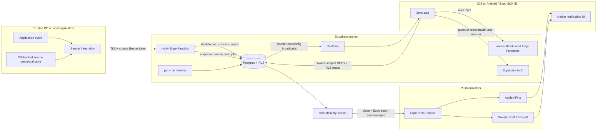

# Zona architecture

This document describes version 1 of Zona: an Expo SDK 56 mobile application,
Supabase backend, and direct source API. It is normative alongside the
[PRD](PRD.md) and [ADR 0001](adr/0001-source-token-architecture.md).

## System context

## Architectural invariants

1. A sender never receives a Supabase secret/service-role key and never writes
   directly to application tables.
2. Source identity is derived only from the hash of the Bearer credential.
   Payload fields cannot select an owner or source.
3. The notification row is inserted before calling an external push provider.
4. Push is an optimization over the synchronized inbox, not the durable record.
5. Every owner-facing table is protected by row-level security. User-authenticated
   Edge Functions additionally validate the Supabase session themselves.
6. Source credentials are returned once and retained only as SHA-256 hashes.
7. Historical notifications contain a source-name snapshot, so rename does not
   rewrite history.
8. Revocation affects one source credential immediately and does not revoke
   sibling sources.
9. Version 1 contains no remote command channel or arbitrary shell execution.
10. Native compatibility is pinned to Expo SDK 56 until an explicit upgrade is
    designed, tested, and recorded.
11. Human identities, personal accounts, app installations, notification
    sources, and third-party integrations are separate principals. A credential
    issued to one principal cannot authorize another.

## Component boundaries

### Mobile application

The Expo Router application owns presentation, navigation, authentication
session state, permission onboarding, installation identity, push-token
registration, and RLS-backed inbox synchronization.

Starting in v0.0.7, bounded AsyncStorage caches keep recent owner-scoped inbox
pages, sources, preferences, changelog content, and the evaluated runtime
snapshot available between launches. Each key includes the owning user and a
query or environment variant. Screens show fresh cached content immediately,
keep stale content visible while revalidating, and never queue offline writes.
Sign-out increments a per-user cache generation before clearing storage, so a
late network response cannot put private data back after the session ends.

Realtime channels (inbox, runtime bootstrap, and iOS Live Status sync) are
subscribed through one shared helper that recovers silently from dropped
connections. The first resubscribe runs 5 seconds after a failure and
consecutive failures back off exponentially to at most one attempt per minute;
attempts made while the app is backgrounded are deferred to the next
foreground transition. Each successful resubscribe triggers a data refresh,
with repeats suppressed inside a 30-second window so a flapping connection
cannot amplify into reload storms. The Settings relay row shows a neutral
"not checked" state during these outages instead of raw error text.

Recommended internal boundaries as the application grows:

- `providers/`: session and application-wide lifecycle state.
- `lib/supabase`: configured public client only.
- `lib/api`: authenticated Edge Function transport and error normalization.
- `lib/push`: native permission/token lifecycle with platform guards.
- `features/inbox`: paginated query model, realtime reconciliation, and read
  state independent of view components.
- `features/sources`: create, rename, revoke, and credential handoff.
- `components/`: presentation-only reusable controls.

The current implementation is small and may not yet contain every proposed
feature directory. New work should preserve these ownership boundaries rather
than putting transport or persistence directly into screens.

### Authentication and account ownership

Zona keeps private guest start and includes passwordless email, email and
password, Apple, Google, and GitHub recovery flows. The app reads Supabase's
public Auth settings and shows only methods enabled for that deployment.
Password credentials are validated client-side (8–72 UTF-8 bytes, no leading or
trailing whitespace) and forwarded unchanged to Supabase Auth; sign-up and
guest protection confirm the address with a 6-digit code before the credential
activates. A guest is normally upgraded in
place by linking a verified identity to the current Supabase Auth user; changing
the Auth user ID during that flow is a failure. Sign-in on a replacement phone
restores server-held account data but never reveals a source's one-time
plaintext key.

An additive personal account and membership layer becomes the future resource,
billing, and integration boundary. Existing `user_id` ownership remains
authoritative during the old-client compatibility window. Account transfer is
server-only, requires proof of both sessions, and never silently merges two
protected accounts. See [ACCOUNT_MANAGEMENT.md](ACCOUNT_MANAGEMENT.md),
[ADR 0004](adr/0004-recoverable-accounts-and-principal-separation.md), and
[ADR 0005](adr/0005-email-password-sign-in.md).

### User-authenticated Edge Functions

- `create-source`: verifies a user JWT, generates a credential, stores its hash
  through a service-only database function, and returns the secret once.
- `create-source-key` / `manage-source-key`: issues and manages per-source
  access keys server-side (v0.0.8 multi-key rotation).
- `manage-source`: verifies owner scope before rename or revoke.
- `register-push-token`: registers or removes one iOS or Android installation while
  preventing cross-account token reassignment.
- `reauthenticate`: issues one-time reauth grants from a fresh secondary proof.
- `account-security`: consumes reauth grants for identity, installation, and
  session actions.
- `account-transfer`: previews, commits, and cancels guest-account transfers.
- `delete-account`: runs the durable account-deletion job with reauth.
- `auth-transaction`: binds auth flows (protect_guest, link_method) to the
  current installation.
- `test-source`: creates a test inbox item and reports how many durable delivery
  jobs were queued. It uses the same quiet-schedule, retry, and receipt path as
  normal sender traffic.

Supabase gateway JWT verification is intentionally disabled in configuration;
these functions call Supabase Auth to validate the Bearer user token. This is a
security-sensitive invariant. Handler contract tests live in
`supabase/functions/_shared`; CI runs Deno tests/type checks, then serves the
functions against a disposable local Supabase stack for endpoint smoke tests.

### Notification ingestion

`notify` accepts only a source Bearer credential. It validates the bounded JSON
contract (including optional severity) and the required `Idempotency-Key`
header, hashes the credential, and
invokes a security-definer database function. That transaction authenticates
the source, replays or rejects a previously seen idempotency key, serializes
per-source and per-account rate checks, updates last activity, and inserts the
durable notification.

After acceptance, the function enqueues durable push-delivery jobs for the
owner’s active registrations and returns `pushQueued`. Compatibility
`pushAttempted` mirrors that queue count, while `pushAccepted` remains zero
because ticket and receipt work is asynchronous. The
`push-delivery-worker` claims jobs in batches, sends Expo tickets, retries
transient failures with backoff, and polls receipts. Ticket acceptance is not
device delivery proof.

The v0.0.10 app reads one notification's delivery state only through
`get_notification_delivery_summary()`. That owner-checked RPC reduces private
jobs to safe counts and one of `not_sent`, `queued`, `sent`, or
`needs_attention`; it never exposes push tokens, ticket IDs, worker leases, or
raw provider messages. `sent` means APNs or FCM accepted at least one delivery,
not that a person saw it. The notification-detail Delivery card stays silent for
successful `sent` and plain `not_sent` summaries (the inbox already holds the
alert), surfaces `needs_attention` and suppress reasons such as quiet hours, and
only shows a `queued` handoff while the alert is still within a 120-second
window and pending work remains — so an old or stuck queue never claims
"still delivering." A `queued` summary is also re-polled on the configured
interval for at most 120 seconds per notification, with the window restarting
on a manual retry. The notification-detail and Settings delivery surfaces
render only on app version 0.0.10 or later (gated in `src/lib/app-version.ts`)
and remain subject to the `notification.delivery_status` runtime control.

### Database

| Canonical relation | Purpose | Access path |
| --- | --- | --- |
| `public.notification_sources` | Stable source identity and lifecycle | Owner RLS read; service-managed writes |
| `public.source_access_keys` | Safe key metadata: name, prefix, active/expiry/revocation, usage, and sound | Owner RLS read; owner-checked RPC writes |
| `public.notification_source_overview` | Joined source/key data for Sources and its access-key screen | Owner RLS read |
| `public.user_notification_preferences` | Push, sound, lock-screen preview, and Live Status preferences | Owner-checked RPC read/write |
| `private.account_entitlements` | Server-owned plan and subscription state | Service/database function only |
| `public.push_registrations` | Per-owner installation/token mapping | Service-managed only |
| `public.inbox_notifications` | Durable inbox with source-name snapshots, optional severity, and tier-resolved expiry | Owner RLS read; owner-checked RPC mutations |
| `private.source_api_credentials` | SHA-256 source credential hashes | Service-only |
| `private.notification_ingest_requests` | Rolling source/account rate evidence | Service/database function only |
| `private.account_rate_limit_events` | Hourly account operation rate evidence | Service/database function only |
| `private.push_delivery_attempts` | Expo ticket attempt diagnostics | Service/database function only |
| `private.push_delivery_jobs` | Durable per-phone queue, ticket, receipt, retry, and terminal state | Worker/database function only; owner sees only the sanitized summary RPC |
| `private.account_usage_counters` / `private.account_usage_daily` | Server-owned account and recent-volume usage | Owner-checked aggregate RPC only |
| `private.client_event_logs` | Redacted mobile lifecycle and failure diagnostics | Authenticated write RPC; private reads |
| `private.server_event_logs` | Redacted relay/database outcomes with latency and request IDs | Service/database function only |
| `private.daily_usage_stats` | HKT service and per-user operational aggregates | Service/database function only |
| `private.daily_report_runs` | Idempotent daily-pulse delivery ledger | Service/database function only |
| `private.app_feature_controls` | Targeted show/hide/disable/read-only rules | Evaluated only by authenticated bootstrap RPC |
| `private.app_runtime_settings` | Typed, targeted client display values | Evaluated only by authenticated bootstrap RPC |
| `private.service_switches` | Fail-closed ingestion, source, attachment, severity, and push controls | Service/database function only |
| `private.service_plan_limits` | Typed standard/premium limits | Service/database function only |
| `private.client_release_policies` | Per-platform build, update, and maintenance policy | Evaluated only by authenticated bootstrap RPC |
| `private.app_announcements` | Scheduled localized in-app notices | Evaluated only by authenticated bootstrap RPC |
| `public.app_release_notes` / `public.app_release_note_items` | Published releases and independently active cards | Authenticated read of active, in-window rows |
| `storage.objects` (`notification-attachments`) | Evidence images foldered by owner | Owner RLS read/delete; service-only writes |

The v0.0.5 binary still addresses several legacy physical table names. During
the compatibility window, canonical public/private names are security-invoker
views and owner writes go through stable RPCs. `app_release_notes` is already a
physical rename because the legacy `app_changelog` surface is read-only and can
be preserved safely as a compatibility view. The remaining physical cutover is
deferred until release policy confirms v0.0.5 is retired.

Service-only security-definer functions implement source creation, atomic
ingestion, and push-attempt recording. Their `search_path` is fixed and execute
permission is revoked from public, anonymous, and authenticated roles.

### Scheduled cleanup

An hourly `pg_cron` job deletes expired notification rows and rate-limit rows.
The v0.0.7 observability job retains redacted raw events for 30 days and daily
aggregates for 400 days. A separate 00:05 HKT (16:05 UTC) job invokes the
daily-report Edge Function, which renders a seven-day PNG locally and sends the
previous day's service pulse through an operator-owned Zona source. See
[OBSERVABILITY.md](OBSERVABILITY.md).
Rate-limit evidence older than one day is removed. Delivery log rows cascade
when their notification expires.
Source, credential, push-device, and Auth records remain until their lifecycle
event or account deletion.

## Critical flows

### Source creation

The current app uses the authenticated Edge API as the canonical creation path.
The older app-generated token/PostgREST RPC remains only as a compatibility
surface for installed pre-v0.0.8 builds:

1. The server generates an opaque `zona_live_…` token with cryptographic
   randomness.
2. It atomically stores the stable source/access-key identity, credential hash,
   and safe metadata; plaintext is never persisted.
3. The no-store response presents the token once, then the user moves it to the
   sender's secret store.
4. A source may later receive a second independently revocable key for overlap
   rotation without changing the source UUID, display name, sound, or history.

The one-to-many schema and old-client compatibility rules are specified in
[ACCOUNT_MANAGEMENT.md](ACCOUNT_MANAGEMENT.md) and ADR 0001's v0.0.8 amendment.
OpenAPI changes ship with the implementation, not ahead of it.

Losing a token does not make it recoverable. In the current app, create a
replacement key on the same source, verify it, then revoke only the lost key.
Pre-v0.0.8 clients must instead create a replacement source.

### Notification acceptance

1. Sender posts bounded JSON over TLS with its source token, or
   `multipart/form-data` when attaching one evidence image.
2. Edge Function hashes the token, validates the payload (image format comes
   from magic bytes, never from names or headers), and calls atomic ingestion.
3. Database locks the source’s rate-limit key, verifies access-key active/expiry
   state and revocation, records usage, snapshots the source name, inserts the
   notification, and creates eligible per-phone delivery jobs. Account/source
   quiet schedules suppress only those jobs. Severity and the image’s SHA-256
   participate in the idempotency hash.
4. A sent image is uploaded to the private `notification-attachments` bucket at
   `{user_id}/{notification_id}` and its metadata is written to the row.
5. The function reads the durable queue count and returns HTTP 202 without
   waiting for Expo. `pushQueued: 0` is valid when push is disabled, no eligible
   phone exists, or a quiet schedule applies.
6. The worker later applies preview/sound preferences, sends Expo batches,
   records tickets and receipts, and retries bounded transient failures.
7. The app receives a realtime event or fetches the row on refresh, and reads
   the image through an owner-scoped signed URL.

If attachment upload or push delivery fails, steps 3 and 7 remain valid. The
accepted inbox row is authoritative; attachment storage is best effort and push
has its own durable retry lifecycle.

### Rename, pause, and revoke

Rename updates the source and access-key metadata names; existing notification
snapshots do not change. Pausing sets the access key's `is_active` flag false
and is reversible. Revocation sets `revoked_at` and permanently deactivates the key.
The credential hash remains until account deletion or an approved purge policy.
Routine rename/pause actions also use authenticated PostgREST RPC wrappers so
the Sources/access-key screens do not wait for an Edge Function cold start.

### Push interaction

Push payload data contains the accepted notification UUID and source UUID. The
app routes a user interaction to the detail screen, whose database read remains
subject to the current owner session and RLS. A push payload alone grants no
record access.

## Trust boundaries and secrets

| Boundary | Credential | Storage rule |
| --- | --- | --- |
| Mobile app to Supabase Auth/RLS | User access/refresh session | Platform-appropriate client storage managed by Supabase client configuration |
| Sender to `notify` | Per-source Bearer token | OS-backed secret store; never source control, logs, URL, or metadata |
| Edge Function to database | Supabase secret/service role | Hosted secret only; never Expo or sender configuration |
| Backend to Expo | Expo push token payload | Server-side request; token stored as account data |

Public/publishable Supabase keys are identifiers, not service credentials, but
they must still be environment-configured so builds target the intended project.

## Environments and configuration

At minimum, use distinct local/development and production configuration.
Preview/staging should use a separate Supabase project when release frequency or
data sensitivity warrants it.

Configuration inventory:

- Mobile: `EXPO_PUBLIC_SUPABASE_URL`,
  `EXPO_PUBLIC_SUPABASE_PUBLISHABLE_KEY`, owned iOS bundle identifier, linked
  EAS project UUID.
- Supabase: project URL, publishable key, secret/service-role key, Auth
  anonymous sign-in enabled, Realtime publication, `pg_cron` job.
- Apple/Expo: Apple Developer team, App Store Connect application, signing
  certificate/profile, APNs key, EAS project and production environment.

Never use production secrets in local `.env` files. The Expo app must contain
only public values.

## Scaling and reliability limits

- The API rate limit is per source (60/minute) and per account (20/minute
  aggregate for the current standard plan), not per IP. Both are resolved from
  typed `private.service_plan_limits`; the source value can be lowered during
  the compatibility window, while the legacy hardened ingest implementation
  retains a 60/minute ceiling. Platform-level abuse limits remain desirable.
- The inbox must use cursor pagination; a fixed `.limit(200)` is not a complete
  seven-day inbox at permitted ingestion rates.
- Expo recommends bounded push message batches. Ingest enqueues durable
  push-delivery jobs; `push-delivery-worker` sends in Expo-sized batches and
  processes receipts asynchronously.
- Senders must supply an `Idempotency-Key`; an identical replay returns the
  original record. Duplicates remain possible only when a sender mints a fresh
  key per attempt instead of per logical event.
- Each notification may carry one evidence image (PNG/JPEG/WebP, magic-byte
  verified, capped at the tier-resolved configured size — 5 MiB standard by
  default) in a private bucket with owner-folder RLS.
  Rich-push images on the lock screen would need an iOS Notification Service
  Extension and are out of scope.
- Receipt feedback permanently fails jobs for invalid/stale Expo tokens and
  disables those registrations when Expo reports `DeviceNotRegistered`.
- “Last activity” is the most recent accepted alert, not a reliable online
  presence signal.

These limits must be represented honestly in UI and operations.

## Future command execution

PC control is outside version 1. It must not reuse the notification token as a
general remote-control capability. Any future design requires:

- a new ADR and threat model;
- explicit target selection and online/presence semantics;
- a dedicated command credential and transport;
- an allowlist of typed commands and bounded parameters;
- local user consent, authorization, audit events, expiry, replay defense, and
  result correlation; and
- an absolute prohibition on arbitrary shell input.

## Related documents

- [Product requirements](PRD.md)
- [OpenAPI contract](openapi.yaml)
- [Threat model](THREAT_MODEL.md)
- [Test plan](TEST_PLAN.md)
- [Runbook](RUNBOOK.md)
- [Runtime controls](RUNTIME_CONTROLS.md)
- [ADR 0001](adr/0001-source-token-architecture.md)
- [ADR 0003](adr/0003-runtime-controls-and-canonical-schema.md)
