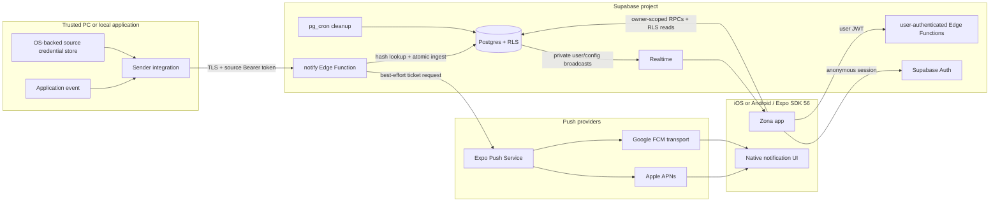

# Zona architecture

This document describes version 1 of Zona: an Expo SDK 56 mobile application,
Supabase backend, and direct source API. It is normative alongside the
[PRD](PRD.md) and [ADR 0001](adr/0001-source-token-architecture.md).

## System context

## Architectural invariants

1. A sender never receives a Supabase secret/service-role key and never writes
   directly to application tables.
2. Source identity is derived only from the hash of the Bearer credential.
   Payload fields cannot select an owner or source.
3. The notification row is inserted before calling an external push provider.
4. Push is an optimization over the synchronized inbox, not the durable record.
5. Every owner-facing table is protected by row-level security. User-authenticated
   Edge Functions additionally validate the Supabase session themselves.
6. Source credentials are returned once and retained only as SHA-256 hashes.
7. Historical notifications contain a source-name snapshot, so rename does not
   rewrite history.
8. Revocation affects one source credential immediately and does not revoke
   sibling sources.
9. Version 1 contains no remote command channel or arbitrary shell execution.
10. Native compatibility is pinned to Expo SDK 56 until an explicit upgrade is
    designed, tested, and recorded.

## Component boundaries

### Mobile application

The Expo Router application owns presentation, navigation, authentication
session state, permission onboarding, installation identity, push-token
registration, and RLS-backed inbox synchronization.

Starting in v0.0.7, bounded AsyncStorage caches keep recent owner-scoped inbox
pages, sources, preferences, changelog content, and the evaluated runtime
snapshot available between launches. Each key includes the owning user and a
query or environment variant. Screens show fresh cached content immediately,
keep stale content visible while revalidating, and never queue offline writes.
Sign-out increments a per-user cache generation before clearing storage, so a
late network response cannot put private data back after the session ends.

Recommended internal boundaries as the application grows:

- `providers/`: session and application-wide lifecycle state.
- `lib/supabase`: configured public client only.
- `lib/api`: authenticated Edge Function transport and error normalization.
- `lib/push`: native permission/token lifecycle with platform guards.
- `features/inbox`: paginated query model, realtime reconciliation, and read
  state independent of view components.
- `features/sources`: create, rename, revoke, and credential handoff.
- `components/`: presentation-only reusable controls.

The current implementation is small and may not yet contain every proposed
feature directory. New work should preserve these ownership boundaries rather
than putting transport or persistence directly into screens.

### User-authenticated Edge Functions

- `create-source`: verifies a user JWT, generates a credential, stores its hash
  through a service-only database function, and returns the secret once.
- `manage-source`: verifies owner scope before rename or revoke.
- `register-push-token`: registers or removes one iOS or Android installation while
  preventing cross-account token reassignment.

Supabase gateway JWT verification is intentionally disabled in configuration;
these functions call Supabase Auth to validate the Bearer user token. This is a
security-sensitive invariant and needs endpoint tests in CI.

### Notification ingestion

`notify` accepts only a source Bearer credential. It validates the bounded JSON
contract (including optional severity) and the required `Idempotency-Key`
header, hashes the credential, and
invokes a security-definer database function. That transaction authenticates
the source, replays or rejects a previously seen idempotency key, serializes
per-source and per-account rate checks, updates last activity, and inserts the
durable notification.

After acceptance, the function reads the owner’s push registrations and makes
one Expo Push Service request. Ticket results are logged. Version 1 does not
queue retries or poll push receipts; `pushAccepted` is not delivery proof.

### Database

| Canonical relation | Purpose | Access path |
| --- | --- | --- |
| `public.notification_sources` | Stable source identity and lifecycle | Owner RLS read; service-managed writes |
| `public.source_access_keys` | Safe key metadata: name, prefix, active/expiry/revocation, usage, and sound | Owner RLS read; owner-checked RPC writes |
| `public.notification_source_overview` | Joined source/key data for the API Keys screen | Owner RLS read |
| `public.user_notification_preferences` | Push, sound, lock-screen preview, and Live Status preferences | Owner-checked RPC read/write |
| `private.account_entitlements` | Server-owned plan and subscription state | Service/database function only |
| `public.push_registrations` | Per-owner installation/token mapping | Service-managed only |
| `public.inbox_notifications` | Durable inbox with source-name snapshots, optional severity, and tier-resolved expiry | Owner RLS read; owner-checked RPC mutations |
| `private.source_api_credentials` | SHA-256 source credential hashes | Service-only |
| `private.notification_ingest_requests` | Rolling source/account rate evidence | Service/database function only |
| `private.account_rate_limit_events` | Hourly account operation rate evidence | Service/database function only |
| `private.push_delivery_attempts` | Expo ticket attempt diagnostics | Service/database function only |
| `private.app_feature_controls` | Targeted show/hide/disable/read-only rules | Evaluated only by authenticated bootstrap RPC |
| `private.app_runtime_settings` | Typed, targeted client display values | Evaluated only by authenticated bootstrap RPC |
| `private.service_switches` | Fail-closed ingestion, source, attachment, severity, and push controls | Service/database function only |
| `private.service_plan_limits` | Typed standard/premium limits | Service/database function only |
| `private.client_release_policies` | Per-platform build, update, and maintenance policy | Evaluated only by authenticated bootstrap RPC |
| `private.app_announcements` | Scheduled localized in-app notices | Evaluated only by authenticated bootstrap RPC |
| `public.app_release_notes` / `public.app_release_note_items` | Published releases and independently active cards | Authenticated read of active, in-window rows |
| `storage.objects` (`notification-attachments`) | Evidence images foldered by owner | Owner RLS read/delete; service-only writes |

The v0.0.5 binary still addresses several legacy physical table names. During
the compatibility window, canonical public/private names are security-invoker
views and owner writes go through stable RPCs. `app_release_notes` is already a
physical rename because the legacy `app_changelog` surface is read-only and can
be preserved safely as a compatibility view. The remaining physical cutover is
deferred until release policy confirms v0.0.5 is retired.

Service-only security-definer functions implement source creation, atomic
ingestion, and push-attempt recording. Their `search_path` is fixed and execute
permission is revoked from public, anonymous, and authenticated roles.

### Scheduled cleanup

An hourly `pg_cron` job deletes expired notification rows and rate-limit rows
older than one day. Delivery log rows cascade when their notification expires.
Source, credential, push-device, and Auth records remain until their lifecycle
event or account deletion.

## Critical flows

### Source creation

1. The app generates an opaque `zona_live_…` token using native secure random
   bytes and hashes it locally.
2. An authenticated PostgREST RPC atomically stores the stable source UUID,
   credential hash, and safe API-key metadata without an Edge cold start.
3. Row isolation comes from `auth.uid()` inside the owner-only wrapper; the
   service-only internal function still enforces limits and validation.
4. A safe `api_keys` metadata row stores the name, short prefix, active state,
   timestamps, and optional expiry; it never stores the raw token or hash.
5. The response is marked `Cache-Control: no-store` and presents the token once.
6. The user moves it to the sender’s secret store.

Losing a token does not make it recoverable. Create a replacement source,
verify it, and revoke the old source.

### Notification acceptance

1. Sender posts bounded JSON over TLS with its source token, or
   `multipart/form-data` when attaching one evidence image.
2. Edge Function hashes the token, validates the payload (image format comes
   from magic bytes, never from names or headers), and calls atomic ingestion.
3. Database locks the source’s rate-limit key, verifies API-key active/expiry
   state and revocation, records usage, snapshots the source name, and inserts
   the notification. Severity and the image’s SHA-256 participate in the
   idempotency hash.
4. A sent image is uploaded to the private `notification-attachments` bucket at
   `{user_id}/{notification_id}` and its metadata is written to the row.
5. Function reads the owner's notification preferences and the originating
   access key's `sound_name`; it
   may skip push, remove sound, choose a bundled per-source sound, or replace
   lock-screen content with a generic private preview before Expo delivery.
6. Function records tickets/failures and returns HTTP 202.
7. The app receives a realtime event or fetches the row on refresh, and reads
   the image through an owner-scoped signed URL.

If step 4 or 5 fails, steps 3 and 7 remain valid; attachment storage is
best-effort exactly like push.

### Rename, pause, and revoke

Rename updates the source and API-key metadata names; existing notification
snapshots do not change. Pausing sets `api_keys.is_active = false` and is
reversible. Revocation sets `revoked_at` and permanently deactivates the key.
The credential hash remains until account deletion or an approved purge policy.
Routine rename/pause actions also use authenticated PostgREST RPC wrappers so
the API Keys screen does not wait for an Edge Function cold start.

### Push interaction

Push payload data contains the accepted notification UUID and source UUID. The
app routes a user interaction to the detail screen, whose database read remains
subject to the current owner session and RLS. A push payload alone grants no
record access.

## Trust boundaries and secrets

| Boundary | Credential | Storage rule |
| --- | --- | --- |
| iPhone to Supabase Auth/RLS | User access/refresh session | Platform-appropriate client storage managed by Supabase client configuration |
| Sender to `notify` | Per-source Bearer token | OS-backed secret store; never source control, logs, URL, or metadata |
| Edge Function to database | Supabase secret/service role | Hosted secret only; never Expo or sender configuration |
| Backend to Expo | Expo push token payload | Server-side request; token stored as account data |

Public/publishable Supabase keys are identifiers, not service credentials, but
they must still be environment-configured so builds target the intended project.

## Environments and configuration

At minimum, use distinct local/development and production configuration.
Preview/staging should use a separate Supabase project when release frequency or
data sensitivity warrants it.

Configuration inventory:

- Mobile: `EXPO_PUBLIC_SUPABASE_URL`,
  `EXPO_PUBLIC_SUPABASE_PUBLISHABLE_KEY`, owned iOS bundle identifier, linked
  EAS project UUID.
- Supabase: project URL, publishable key, secret/service-role key, Auth
  anonymous sign-in enabled, Realtime publication, `pg_cron` job.
- Apple/Expo: Apple Developer team, App Store Connect application, signing
  certificate/profile, APNs key, EAS project and production environment.

Never use production secrets in local `.env` files. The Expo app must contain
only public values.

## Scaling and reliability limits

- The API rate limit is per source (60/minute) and per account (20/minute
  aggregate for the current standard plan), not per IP. Both are resolved from
  typed `private.service_plan_limits`; the source value can be lowered during
  the compatibility window, while the legacy hardened ingest implementation
  retains a 60/minute ceiling. Platform-level abuse limits remain desirable.
- The inbox must use cursor pagination; a fixed `.limit(200)` is not a complete
  seven-day inbox at permitted ingestion rates.
- Expo recommends bounded push message batches. If installation counts grow,
  ingestion should enqueue push fan-out rather than extend request latency.
- Senders must supply an `Idempotency-Key`; an identical replay returns the
  original record. Duplicates remain possible only when a sender mints a fresh
  key per attempt instead of per logical event.
- Each notification may carry one evidence image (PNG/JPEG/WebP, magic-byte
  verified, capped at the tier-resolved configured size — 5 MiB standard by
  default) in a private bucket with owner-folder RLS.
  Rich-push images on the lock screen would need an iOS Notification Service
  Extension and are out of scope.
- There is no push receipt worker. Invalid/stale Expo tokens are not currently
  pruned from receipt feedback.
- “Last activity” is the most recent accepted alert, not a reliable online
  presence signal.

These limits must be represented honestly in UI and operations.

## Future command execution

PC control is outside version 1. It must not reuse the notification token as a
general remote-control capability. Any future design requires:

- a new ADR and threat model;
- explicit target selection and online/presence semantics;
- a dedicated command credential and transport;
- an allowlist of typed commands and bounded parameters;
- local user consent, authorization, audit events, expiry, replay defense, and
  result correlation; and
- an absolute prohibition on arbitrary shell input.

## Related documents

- [Product requirements](PRD.md)
- [OpenAPI contract](openapi.yaml)
- [Threat model](THREAT_MODEL.md)
- [Test plan](TEST_PLAN.md)
- [Runbook](RUNBOOK.md)
- [Runtime controls](RUNTIME_CONTROLS.md)
- [ADR 0001](adr/0001-source-token-architecture.md)
- [ADR 0003](adr/0003-runtime-controls-and-canonical-schema.md)
