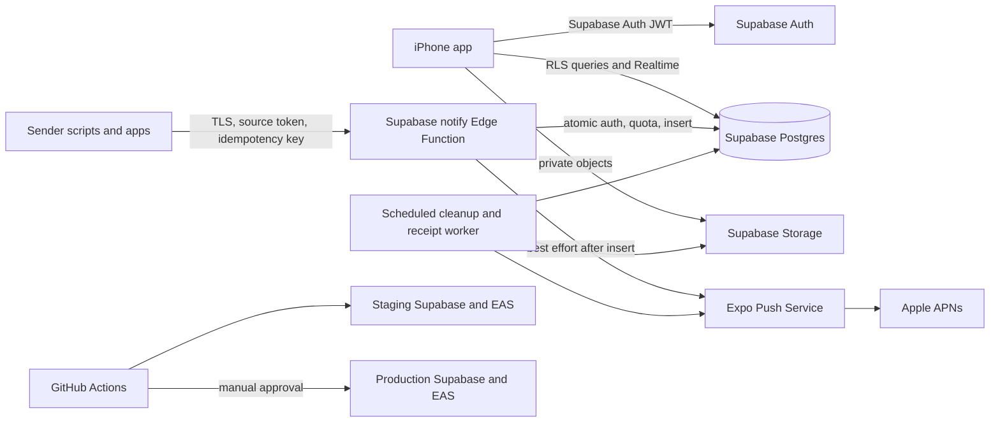

# Zona public launch and monetization plan

Status: Proposal for validation; not an approved production release contract.  
Prepared: 2026-07-24.  
Target: Public iPhone App Store distribution to developers, homelab operators,
and automation users.

This plan does not replace [PRD.md](PRD.md), [THREAT_MODEL.md](THREAT_MODEL.md),
[TEST_PLAN.md](TEST_PLAN.md), or [RELEASE.md](RELEASE.md). Those documents still
describe a private TestFlight product and must be revised and approved before a
public release.

## Recommendation

Keep the current Supabase and Expo architecture for launch. Use Supabase Pro for
production and a separate Supabase project for staging. Do not add Cloudflare,
a custom API, Redis, or a queue until production measurements justify them.

The immediate blockers are product and operational controls, not database
compute:

1. recoverable customer accounts;
2. economic quotas that limit cost per account;
3. complete account and attachment deletion;
4. App Store-compliant subscription entitlements;
5. public privacy, support, security, and incident ownership;
6. database/RLS/contract/load tests and production observability.

## Product position

Zona's current workflow is technical: a user creates a source, receives a
one-time Bearer token, and configures an HTTP sender. The initial public segment
should therefore be developers, homelab operators, and automation users—not all
consumer iPhone owners.

Proposed value proposition:

> A private, durable iPhone inbox for alerts from scripts and computers. Every
> sender has its own revocable key, identity, sound, and seven-day history.

Do not claim guaranteed push delivery, device presence, monitoring, remote
control, or suitability for emergency, safety-critical, medical, or secret
content. The durable inbox is the product; push is best effort.

## Validate before building billing

Run these experiments in order:

1. **Message test:** Send 200 targeted visitors to segment-specific landing
   pages. Continue if at least 10% of qualified visitors join the waitlist.
2. **Concierge TestFlight:** Recruit 15 target users. Continue if at least 60%
   connect a real external sender without live help and median setup is under
   10 minutes.
3. **Retention:** Run a free four-week cohort. Continue if at least 40% remain
   weekly active in week four and at least 30% connect two sources.
4. **Price intent:** Show a non-purchasing price-intent screen. Implement
   billing only if at least 15% tap Subscribe around USD 3.99/month and at least
   five retained users independently confirm willingness to pay.

Use aggregate server-side events only: account created, source created, first
external alert accepted, second source created, week-four activity, and price
intent. Do not collect notification content in analytics.

Stop or reposition if fewer than 5 of 15 testers connect a sender, fewer than 4
remain active after four weeks, or users value only push rather than the durable
multi-source inbox.

## Monetization model

Start with one free tier and one auto-renewable **Zona Plus** subscription.
Avoid ads, lifetime purchases, usage credits, teams, family plans, and multiple
paid tiers until demand exists.

Apple currently requires In-App Purchase to unlock in-app digital
functionality and prohibits monetizing Push Notifications as an operating-system
capability. Basic push must therefore remain available to free users. Sell the
ongoing hosted service capacity instead: sources, ingestion allowance,
attachments, devices, and support.

Suggested starting offer for validation:

| Capability | Free | Zona Plus |
| --- | ---: | ---: |
| Active sources | 2 | 10 |
| Registered iPhones | 1 | 3 |
| Accepted alerts per day | 100 | 2,000 |
| Attachments per day | 0 initially | 100 |
| Attachment ingress per day | 0 initially | 250 MiB |
| Retention | 7 days | 7 days |
| Push and source attribution | Included | Included |
| Candidate price | Free | USD 3.99/month or USD 29.99/year |

Keep existing minute-level limits for burst protection. Daily quotas are
separate economic controls. Start free accounts without attachments because a
5 MiB attachment is the largest user-controlled variable cost.

Pricing is a hypothesis, not a commitment. Localize through App Store pricing
and review tax, consumer-protection, refund, and subscription terms before sale.
Consider Apple's Small Business Program if eligible.

## Identity and entitlement architecture

Anonymous sign-in is useful for evaluation but cannot be the only identity for
a paid account. App deletion or sign-out can currently orphan the account.

Required flow:

1. Allow anonymous evaluation within a small free quota.
2. Require account linking before purchase or before creating a long-lived
   second source.
3. Offer passwordless email, Apple, Google, and GitHub as recoverable methods;
   keep Apple first-class in the iPhone experience.
4. Preserve the existing Supabase `auth.users.id` when linking the anonymous
   identity so existing sources and inbox rows do not move.
5. Provide sign-in restoration, Restore Purchases, subscription management,
   and explicit account deletion.

Use StoreKit through a maintained React Native integration. RevenueCat is the
shortest implementation path for purchase state and webhooks; direct StoreKit
reduces vendors but requires more receipt and lifecycle code. Decide after the
validation phase.

Regardless of provider, the server remains authoritative. Add an entitlement
record containing account ID, product, original transaction ID, environment,
status, expiry, grace period, revocation, and last verification time. Verify
signed App Store notifications/webhooks, process them idempotently, and enforce
quotas inside database functions—not only in the mobile UI. The complete
identity, installation, and transfer contract is in
[ACCOUNT_MANAGEMENT.md](ACCOUNT_MANAGEMENT.md).

Define behavior for billing grace, expiration, refund, revocation, account
linking, Restore Purchases, account deletion, and a Plus account falling above
free limits. The safest downgrade behavior is to stop new over-quota writes
without deleting existing data before normal retention.

## Public-launch security changes

### P0 before public beta

- Replace the private/single-owner authentication ADR with a public account
  lifecycle ADR.
- Add daily per-account alert, attachment-count, and attachment-byte quotas.
- Add project-wide ingestion and attachment kill switches.
- Apply provider signup rate limits and CAPTCHA or device attestation to account
  creation where supported. Per-account limits alone do not stop creation of
  fresh anonymous accounts.
- Fix account deletion so it removes all owner-prefixed Storage objects as well
  as database and Auth records. Make deletion idempotent and retryable.
- Remove an uploaded object if attachment metadata persistence fails.
- Enforce multipart request size before unbounded buffering at the gateway or
  with a byte-counting parser.
- Implement the v0.0.8 canonical server-generated Edge source-key path, keep the
  client-hash RPC only for old-build compatibility, then retire it when release
  policy permits.
- Default lock-screen previews to private/redacted content for new public
  accounts.
- Publish completed privacy, terms, support, and security contacts and link them
  directly in the app.

### P1 before paid launch

- Poll Expo push receipts approximately 15 minutes after submission and disable
  `DeviceNotRegistered` tokens.
- Store normalized push diagnostics rather than complete provider responses.
- Enable Expo push access-token security.
- Add two-user RLS tests, Edge Function/OpenAPI contract tests, rate-limit and
  quota concurrency tests, migration upgrade tests, deletion tests, attachment
  isolation tests, and streaming-size tests.
- Pin GitHub Actions and EAS CLI versions; protect production deployments with
  approvals and environment-scoped credentials.
- Add dependency, static, secret, and produced-bundle scans. No critical/high
  finding ships without an approved, expiring exception.

## Initial hosting architecture

### Environments

| Environment | Purpose | Rule |
| --- | --- | --- |
| Local | Supabase reset, RLS, contract, and migration tests | Synthetic data only |
| Staging | Persistent production-like backend and TestFlight build | Separate project and credentials |
| Production | Public users and App Store build | Protected deployments; no local service credentials |
| Restore drill | Temporary isolated recovery verification | Never restore over production for testing |

### Starting services

- **Supabase Pro production project**, initially Micro compute.
- **Separate staging Supabase project** in the same Pro organization or an
  isolated organization if access separation requires it.
- **Expo/EAS Starter** initially; upgrade for build concurrency, OTA MAU,
  support, or code-signing needs—not merely because the app is public.
- **Apple Developer Program** and App Store Connect.
- **GitHub Actions** for verification and controlled deployment.
- Supabase metrics plus a simple external synthetic check and alerting service.

At prices viewed on 2026-07-24, Supabase Pro starts at USD 25/month and two
Micro projects in one Pro organization are approximately USD 35/month. Expo
Starter is USD 19/month. Pricing changes; verify before purchase.

### Backups

Supabase Pro daily database backups retain seven days, but database backups do
not include Storage object bytes. For the first small public release:

- approve an explicit RPO of up to 24 hours and RTO target;
- keep an encrypted object inventory/export or explicitly accept loss of
  seven-day evidence images;
- perform quarterly isolated restore drills;
- enable seven-day PITR when the accepted RPO becomes less than 24 hours or
  revenue justifies it. Current PITR pricing is approximately USD 100/month and
  requires at least Small compute.

## CI/CD and release flow

### Pull requests

1. Mobile lockfile install, SDK check, typecheck, lint, tests, Expo Doctor, and
   iOS export.
2. Deno format, lint, check, and unit tests.
3. Local Supabase reset from zero and upgrade from the previous release schema.
4. Database/RLS and Edge Function/OpenAPI contract tests.
5. Dependency, static, secret, and generated-bundle scans.

### Main branch

1. Repeat all gates.
2. Apply migrations to staging.
3. Deploy every reviewed Edge Function from the same immutable revision.
4. Run cross-tenant, ingestion, quota, deletion, attachment, push-failure, and
   synthetic inbox smoke tests.
5. Bake and observe before a release tag.

### Production release

1. Confirm backup/PITR and migration recovery plan.
2. Require release, security/privacy, and operations approval.
3. Apply backward-compatible migrations, deploy functions, and run synthetic
   smoke tests.
4. Build the same revision with EAS, distribute through internal TestFlight,
   and complete the physical-device matrix.
5. Submit the tested build and use phased App Store rollout.
6. Publish OTA updates to staging first, then promote the same revision with a
   gradual production rollout and a rehearsed rollback.

Never automatically roll back database migrations. Prefer reviewed forward
repair.

## Observability and cost controls

Track without notification content:

- accounts and linked/recoverable-account percentage;
- activation funnel and retained active accounts;
- accepted, replayed, rejected, rate-limited, and quota-limited requests;
- function latency/status by deployment revision and correlation ID;
- database CPU, memory, pool connections, I/O, locks, size, and slow queries;
- Edge invocations, Realtime connections/messages, Storage size/egress, and
  attachment bytes by tier;
- push tickets, receipts, invalid devices, and provider failures;
- cleanup age/backlog and oldest expired row/object;
- subscription state, webhook failures, grace, refund, and entitlement drift;
- cost per free account, paid account, accepted alert, and retained subscriber.

Keep Supabase spend caps enabled during beta. Add budget alerts at 50%, 75%,
90%, and forecasted 100%. Define a project-wide emergency switch that can stop
attachments or ingestion while preserving authenticated inbox reads.

Suggested initial internal objectives:

- durable notification API availability: 99.9% monthly;
- durable acceptance p95: under 1 second;
- accepted item visible after refresh: within 10 seconds;
- expired data freshness: under 2 hours;
- critical incident acknowledgment: within 30 minutes.

Do not sell an external SLA while Supabase Pro and Expo Push provide no matching
contractual SLA.

## When to scale or extract components

Do not upgrade by user count alone. Upgrade from Micro to Small/Medium only
after query optimization and staging reproduction show sustained CPU,
connection, memory, I/O, or latency pressure—use 70% sustained utilization as
an investigation trigger.

The likely first extraction is asynchronous push, not the database. Add a
transactional outbox plus managed worker when Expo latency affects acceptance,
receipt polling/retries become a product promise, or fan-out exceeds the current
device cap. The database insert must remain authoritative and precede push.

Add a Cloudflare gateway only when invalid traffic materially affects cost or
availability, a branded API domain is commercially required, or edge WAF/IP
controls are needed. Keep source authorization and authoritative quotas in
Postgres. Prevent direct-origin bypass before claiming the gateway protects the
service.

Move attachments to another object store only when Storage/egress is a top cost
or a regional requirement appears. Do not replace Supabase Auth, Postgres, RLS,
Realtime, or Storage preemptively.

## Phased roadmap

### Phase 0 — Product validation

- Recruit target users and measure setup, retention, and price intent.
- Improve sender examples and onboarding copy; do not rebuild a Windows
  companion yet.
- Exit only when the validation thresholds above pass.

### Phase 1 — Public-safe foundation

- Recoverable identity and anonymous-account upgrade.
- Economic quotas and abuse controls.
- Correct deletion and attachment cleanup.
- Public legal/support package and redacted previews.
- Complete automated security and contract tests.

### Phase 2 — Monetization

- One StoreKit subscription and Restore Purchases.
- Server-authoritative entitlements and webhook processing.
- Free/Plus quota enforcement and downgrade semantics.
- Subscription disclosure, terms, support, refunds, and App Review notes.

### Phase 3 — Production operations

- Supabase Pro production plus isolated staging.
- Protected deployment pipeline, backups, restore drill, synthetic monitoring,
  dashboards, alerts, on-call owner, and phased rollout.
- Physical-device and App Store release evidence.

### Phase 4 — Measured scaling

- Increase Supabase compute only on observed saturation.
- Add transactional push outbox/worker when reliability or latency requires it.
- Add gateway, alternate object storage, or custom services only at documented
  cost, abuse, compliance, or reliability thresholds.

## Go-live decision

Public distribution is allowed only when:

- the public PRD, authentication ADR, threat model, privacy notice, terms, and
  support contacts are approved;
- no critical/high security finding remains open;
- paid accounts are recoverable and purchases restorable;
- quotas and kill switches bound anonymous and paid-user cost;
- deletion removes Auth, database, push, billing linkage as required, and
  Storage objects;
- RLS, contract, concurrency, quota, migration, load, and physical-iPhone tests
  have current evidence;
- production backups, monitoring, incident ownership, and rollback are tested;
- App Store metadata, privacy answers, subscription disclosures, and reviewer
  access are complete.

## External references checked

- [Apple App Review Guidelines](https://developer.apple.com/app-store/review/guidelines/), checked 2026-07-24.
- [Supabase pricing](https://supabase.com/pricing), checked 2026-07-24.
- [Supabase backups](https://supabase.com/docs/guides/platform/backups), checked 2026-07-24.
- [Expo pricing](https://expo.dev/pricing), checked 2026-07-24.
- [Expo push reliability](https://docs.expo.dev/push-notifications/sending-notifications/), checked 2026-07-24.
- [EAS Update deployment](https://docs.expo.dev/eas-update/deployment/), checked 2026-07-24.
